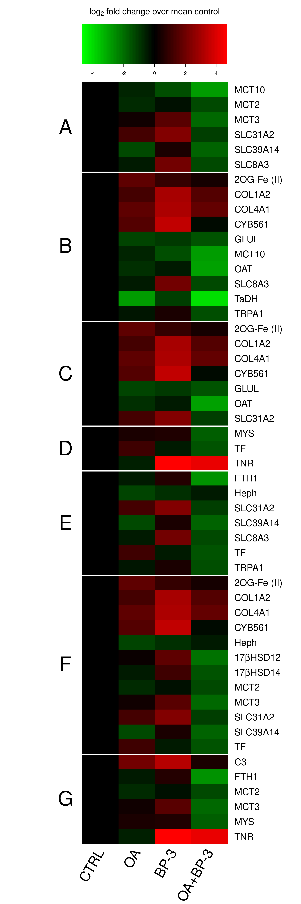

# Loading R Libraries
```{r message=FALSE, warning=FALSE}
library(xlsx)
library(tidyr)
library(dplyr)
library(knitr)
library(gplots)
library(car)
```

# Reading and formatting data
```{r message=FALSE, warning=FALSE}
exaip=read.xlsx("OA & BP3 data for stats sent to Kirt - 10-5-23 updated.xlsx",sheetIndex = 1,startRow = 2)
exaip$Gene.ID[which(exaip$Gene.ID=="TPRA1-13")]="TRPA1"
exaip$Gene.ID[which(exaip$Gene.ID=="COL1A2-11")]="COL1A2"
exaip$Gene.ID[which(exaip$Gene.ID=="COL4A1-11")]="COL4A1"
exaip$Gene.ID[which(exaip$Gene.ID=="SLC31A2-1")]="SLC31A2"
exaip$Gene.ID[which(exaip$Gene.ID=="TNR-2")]="TNR"

```

Filling in the unfilled Gene.ID rows
```{r}
for (i in 1:nrow(exaip)){
  if (is.na(exaip$Gene.ID[i])){exaip$Gene.ID[i]=exaip$Gene.ID[i-1]}
}
```

Removing MCT8
```{r}
exaip=exaip[exaip$Gene.ID!="MCT8",]
```


Making some easier to work with column names
```{r}
colnames(exaip)=c("Gene.ID","ctrl","oa","oa+bp3","bp3")
```


Converting data to long format
```{r}
exaip=exaip %>% 
  gather(key = "treatment", value = "expression", -Gene.ID)
```

Changing data from just 4 treatments to the levels of the two different factors
```{r}
exaip$oa=247
exaip$oa[grepl("oa",exaip$treatment)]=2045
exaip$bp3=0
exaip$bp3[grepl("bp3",exaip$treatment)]=1
exaip=exaip[,c(1,2,4,5,3)]
exaip$measure=rep(c("average","low","high"),nrow(exaip)/3)
exaip$bp3=as.factor(exaip$bp3)
exaip$oa=as.factor(exaip$oa)
```

# Two-way ANOVA
For each gene, perform a two-way ANOVA to determine the significance of the main effects and interaction. I am putting the p-values into a matrix called "results".

```{r}
assumptions=matrix(data = NA,nrow=length(unique(exaip$Gene.ID)),ncol=2) # to store assumptions tests for each gene
results=matrix(data = NA,nrow=length(unique(exaip$Gene.ID)),ncol=3) # to store results for each gene
rownames(results)=unique(exaip$Gene.ID)
colnames(results)=c("oa_pvalue","bp3_pvalue","interaction_pvalue")


row.no=1

for(gene in unique(exaip$Gene.ID)){
    subset_data <- exaip[exaip$Gene.ID == gene,]
    
    
    model.aov=aov(expression ~ oa * bp3, data = subset_data)
    
    results[row.no,1]=summary(model.aov)[[1]][["Pr(>F)"]][1]
    results[row.no,2]=summary(model.aov)[[1]][["Pr(>F)"]][2]
    results[row.no,3]=summary(model.aov)[[1]][["Pr(>F)"]][3]

    assumptions[row.no,1]=leveneTest(expression ~ oa * bp3,data=subset_data)$"Pr(>F)"[1]
    assumptions[row.no,2]=shapiro.test(residuals(model.aov))$p.value
    row.no=row.no+1

    
  }

```

Next, I am adjusting the p-values using the Benjamini-Hochberg FDR correction.
```{r}
results.adj=matrix(p.adjust(results, method = "BH"),nrow=length(unique(exaip$Gene.ID)),ncol=3)
rownames(results.adj)=unique(exaip$Gene.ID)
rownames(assumptions)=unique(exaip$Gene.ID)
colnames(results.adj)=c("oa_pvalue","bp3_pvalue","interaction_pvalue")
colnames(assumptions)=c("homoscedacity","normality")
write.csv(results.adj,"ptable.csv")
```

And, here is a table of the p-values rounded to four decimal places.

```{r}
kable(format(round(results.adj,4),scientific=F))
```

# Plots
## Heatmaps

First, I am creating a summary of gene expression by treatment for the heatmap
```{r}
treatment.means=aggregate(expression~Gene.ID+treatment,data=exaip,FUN="mean")

exaip.sum=data.frame(
ctrl=treatment.means$expression[treatment.means$treatment=="ctrl"],
oa=treatment.means$expression[treatment.means$treatment=="oa"],
bp3=treatment.means$expression[treatment.means$treatment=="bp3"],
oabp3=treatment.means$expression[treatment.means$treatment=="oa+bp3"]
)


rownames(exaip.sum)=treatment.means$Gene.ID[1:nrow(exaip.sum)]
as.matrix(exaip.sum)
```


Then, I am making the groups for the heatmap
```{r}
Fig4=c("SLC31A2", "SLC39A14", "SLC8A3", "MCT2", "MCT3", "MCT10")
 
Fig6=c("GLUL", "OAT", "COL1A2", "COL4A1", "CYB561", "2OG-Fe II", "tadh", "SLC8A3", "TRPA1", "MCT10")

Fig7=c("COL1A2", "COL4A1", "CYB561", "2OG-Fe II", "GLUL", "OAT", "SLC31A2")

Fig8=c("MYS", "TNR", "TF")

Fig9=c("FTH1", "Heph", "SLC31A2", "SLC39A14", "SLC8A3", "TF", "TRPA1")

Fig10=c("2OG-Fe II", "HSD14", "HSD12", "COL1A2", "COL4A1", "CYB561", "Heph", "MCT2", "MCT3", "MCT8", "SLC31A2", "SLC39A14", "TF")

Fig11=c("FTH1", "C3", "MCT2", "MCT3", "MYS","TNR")


exaip.groups=list(Fig4,Fig6,Fig7,Fig8,Fig9,Fig10,Fig11)

exaip.bound=lapply(exaip.groups,function(i) exaip.sum[rownames(exaip.sum) %in% i,])

exaip.heat=rbind(exaip.bound[[1]],exaip.bound[[2]],exaip.bound[[3]],exaip.bound[[4]],exaip.bound[[5]],exaip.bound[[6]],exaip.bound[[7]])

heat.breaks=numeric()
heat.breaks[1]=nrow(exaip.bound[[1]])

for (i in 2:7){
  heat.breaks[i]=heat.breaks[i-1]+nrow(exaip.bound[[i]])
}

colnames(exaip.heat)=c("CTRL","OA","BP-3","OA+BP-3")

```


Fixing up gene names for the row labels.  
```{r}
row.lab=rownames(exaip.heat)
row.lab[grep("SLC31A2",row.lab)]="SLC31A2"
row.lab[grep("SLC39A14",row.lab)]="SLC39A14"
row.lab[grep("SLC8A3",row.lab)]="SLC8A3"
row.lab[grep("2OG-Fe II",row.lab)]="2OG-Fe (II)"
row.lab[grep("COL1A2",row.lab)]="COL1A2"
row.lab[grep("COL4A1",row.lab)]="COL4A1"
row.lab[grep("CYB561",row.lab)]="CYB561"
row.lab[grep("FTH1",row.lab)]="FTH1"
row.lab[grep("GLUL",row.lab)]="GLUL"
row.lab[grep("Heph",row.lab)]="Heph"
row.lab[grep("HSD12",row.lab)]="17βHSD12"
row.lab[grep("HSD14",row.lab)]="17βHSD14"
row.lab[grep("MCT10",row.lab)]="MCT10"
row.lab[grep("MCT2",row.lab)]="MCT2"
row.lab[grep("MCT3",row.lab)]="MCT3"
row.lab[grep("MYS",row.lab)]="MYS"
row.lab[grep("OAT",row.lab)]="OAT"
row.lab[grep("tadh",row.lab)]="TaDH"
row.lab[grep("TF",row.lab)]="TF"
row.lab[grep("TNR",row.lab)]="TNR"
row.lab[grep("TRPA1",row.lab)]="TRPA1"
```

Finally, I am making the heatmap
```{r}
text.labels.x=rep(0.13,7)
text.labels.y=c(0.078,0.24,0.41,0.5,0.59,0.744,0.887)


#svg("heatmap.svg",width=5.00*1.5,height=15.00*1.5,pointsize=8*1.5)
png("heatmap.png",width=5.00*1.5,height=15.00*1.5,units="in",res=300)
par(cex.main=1.7)
heat.plot=heatmap.2(as.matrix(exaip.heat),
          lmat=rbind(3:4,2:1),
          dendrogram = "none",
          col=greenred(99),
          density.info = "none",
          trace="none",
          Rowv = F,
          Colv = F,
          rowsep = heat.breaks,
          cexRow=1.7,
          cexCol=2.5,
          margins=c(9,11),
          lhei=c(0.4,4),
          lwid=c(1.5,4.0),
          key.cex=2,
          key.title =expression("log"[2]*" fold change over mean control"),
          key.par=list(mar=c(3, 0, 4, 12.3)),
          key.xlab="",
          srtCol = 60,
          labRow = row.lab
          )

#points(text.labels.x+0.7,text.labels.y,cex=3,pch=21,bg="purple")
text(text.labels.x,text.labels.y,c("G","F","E","D","C","B","A"),cex=3)
dev.off()
```

Using cairosvg in bash to convert the SVG to a PNG
```{bash}
#cairosvg heatmap.svg -o heatmap.png -d 300
```

Finally, using command line Inkscape to convert the svg to eps for publication.
```{bash}
inkscape $PWD/heatmap.svg -o $PWD/heatmap.eps --export-ignore-filters --export-ps-level=3
```




## Other heatmap
Making a second heatmap that has each gene only once
This first chunk is making the row labels.
```{r}
row.lab2=rownames(exaip.sum)
row.lab2[grep("2OG-Fe II",row.lab2)]="2OG-Fe (II)"
row.lab2[grep("HSD12",row.lab2)]="17βHSD12"
row.lab2[grep("HSD14",row.lab2)]="17βHSD14"
row.lab2[grep("tadh",row.lab2)]="TaDH"

```

And next making the heatmap itself.
```{r}
#svg("heatmap2.svg",width=5.00*1.5,height=7.00*1.5,pointsize=8*1.5)
png("heatmap2.png",width=5.00*1.5,height=7.00*1.5,units="in",res=300)
par(cex.main=1.7)
heat.plot=heatmap.2(as.matrix(exaip.sum)
          ,lmat=rbind(3:4,2:1)
          ,col=greenred(99)
          ,density.info = "none"
          ,trace="none"
          ,Colv = F
          ,cexRow=1.7
          ,cexCol = 2.5,
          ,margins=c(9,11)
          ,lhei=c(0.8,4)
          ,lwid=c(1.3,4.0)
          ,key.title =expression("log"[2]*" fold change over mean control")
          ,key.xlab=""
          ,key.par=list(mar=c(3, 0, 4, 12.3))
          ,labRow = row.lab2
          ,labCol=c("CTRL","OA","BP-3","OA+BP-3")
          ,srtCol=60
          )
dev.off()
```

Converting the svg to a png using cairosvg in bash
```{bash}
#cairosvg heatmap2.svg -o heatmap2.png -d 300
```

Finally, converting the svg to eps for publication with inkscape
```{bash}
inkscape $PWD/heatmap2.svg -o $PWD/heatmap2.eps --export-ignore-filters --export-ps-level=3
```


## Interaction plots
First off I am classifying each of the gene OA+BP-3 effects as antagonistic, synergistic or additive.
```{r}
results.adj=results.adj[order(rownames(results.adj)),]

exaip.bp3=exaip.sum$bp3-exaip.sum$ctrl
exaip.oa=exaip.sum$oabp3-exaip.sum$oa
exaip.category=rep("antagonistic",nrow(exaip.sum))
exaip.category[exaip.bp3>0&exaip.oa>0&exaip.bp3<exaip.oa]="synergistic"
exaip.category[exaip.bp3<0&exaip.oa<0&exaip.bp3>exaip.oa]="synergistic"
exaip.category[results.adj[,3]>0.05]="additive"

table(exaip.category)
```

Next, I am reordering the data so that they plot together by category from the previous chunk.
```{r}
exaip.reorder=order(exaip.category)
exaip.category=exaip.category[exaip.reorder]
exaip.sum=exaip.sum[exaip.reorder,]
```

Then, making an object for the gene names for labeling the plots.
```{r}
interaction.labels=rownames(exaip.sum)
interaction.labels[grep("2OG-Fe II",interaction.labels)]="2OG-Fe (II)"
interaction.labels[grep("HSD12",interaction.labels)]="17βHSD12"
interaction.labels[grep("HSD14",interaction.labels)]="17βHSD14"
interaction.labels[grep("tadh",interaction.labels)]="TaDH"
```

Finally, I am making the interaction plots graph.
```{r}
rows=6
columns=4
antagonistic.col="red"
additive.col="blue"
synergistic.col="darkgreen"
width=0.17
height=0.14
left.offset=0.05
bottom.offset=0.05
hcenters=seq(from=width+left.offset,to=1-width,length.out=columns)
vcenters=seq(from=height+bottom.offset,to=1-height,length.out=rows)
int=1
cat.col=rep(antagonistic.col,length(exaip.category))
cat.col[exaip.category=="additive"]=additive.col
cat.col[exaip.category=="synergistic"]=synergistic.col


svg("interaction_plots.svg",width = 8.5,height=11,pointsize = 10)

plot(c(0,1,0,1),type="n",axes=F,ylab="",xlab="")
mtext(expression("log"[2]*" fold change over mean control"),side=2,cex=2,line=1)
mtext("[Oxybenzone] (ppb)",side=1,cex=2,line=1)
for (i in 1:rows){
  for (j in 1:columns){
    par(fig=c(hcenters[j]-width,hcenters[j]+width,vcenters[i]-height,vcenters[i]+height),new=T)
    plot(c(exaip.sum$ctrl[int],exaip.sum$bp3[int])~c(0,1),type="l",ylim=c(-4,4),xlim=c(-0.15,1.15),
         axes=F,ylab="",xlab="",col=cat.col[int],lwd=1.5)
    lines(c(exaip.sum$oa[int],exaip.sum$oabp3[int])~c(0,1),lty=2,col=cat.col[int],lwd=1.5)
    #box(col="red",lwd=3)
    if (j==1){axis(2,at=c(-3,0,3),las=1,lwd=1.5)}
    if (i==1){axis(1,at=c(0,1),labels = c(0,20),lwd=1.5)}
#    mtext(rownames(exaip.sum)[int],cex=1,side=1,line=-1,col=cat.col[int])
    text(-0.1,0,interaction.labels[int],srt=90,col=cat.col[int],cex=1.3)
    int=int+1
  }
}

line.start=0.05
line.stop=0.3
leg.line=seq(from=0.2,to=0.8,length.out=5)
text.x=((1-line.stop)/2)+line.stop

par(fig=c(hcenters[4]-width,hcenters[4]+width,vcenters[6]-height,vcenters[6]+height),new=T)
plot(c(0,1),c(0,1),type="n",axes=F,ylab="",xlab="")
box()
mtext("Legend",side=3)
lines(c(line.start,line.stop),c(leg.line[5],leg.line[5]),lwd=1.5)
lines(c(line.start,line.stop),c(leg.line[4],leg.line[4]),lty=2,lwd=1.5)
lines(c(line.start,line.stop),c(leg.line[3],leg.line[3]),col=synergistic.col,lwd=1.5)
lines(c(line.start,line.stop),c(leg.line[2],leg.line[2]),col=antagonistic.col,lwd=1.5)
lines(c(line.start,line.stop),c(leg.line[1],leg.line[1]),col=additive.col,lwd=1.5)
text(text.x,leg.line[5],expression("247"*mu*"atm pCO"[2]))
text(text.x,leg.line[4],expression("2045"*mu*"atm pCO"[2]))
text(text.x,leg.line[3],"Synergistic")
text(text.x,leg.line[2],"Antagonistic")
text(text.x,leg.line[1],"Additive")


dev.off()
```

Converting the figure from svg to png with cairosvg.
```{bash}
cairosvg interaction_plots.svg -o interaction_plots.png -d 300
```

And finally converting the figure from svg to eps for publication with inkscape.
```{bash}
inkscape $PWD/interaction_plots.svg -o $PWD/interaction_plots.eps --export-ignore-filters --export-ps-level=3
```

